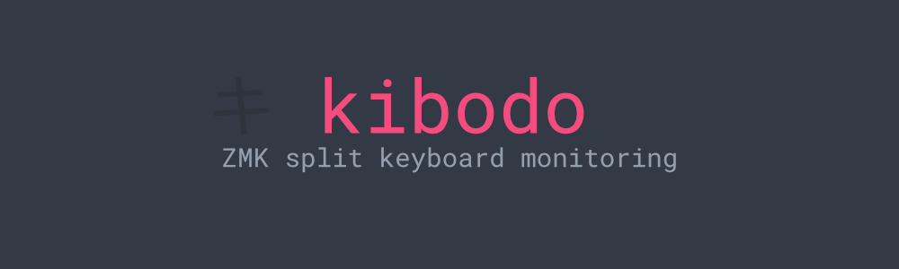
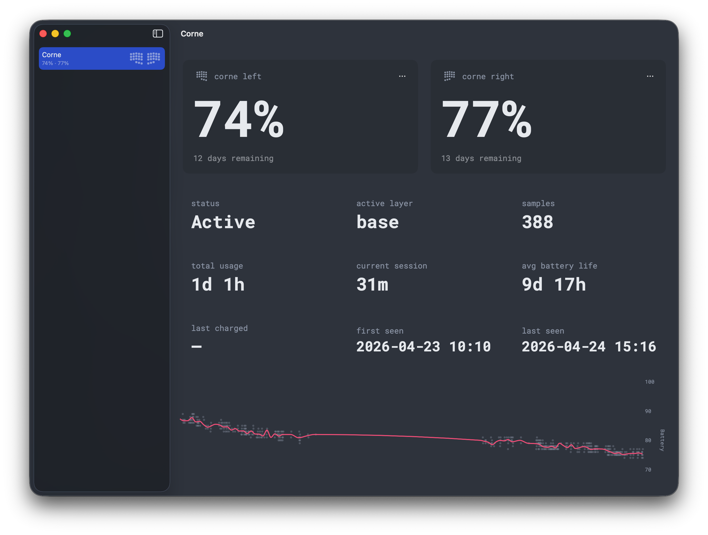
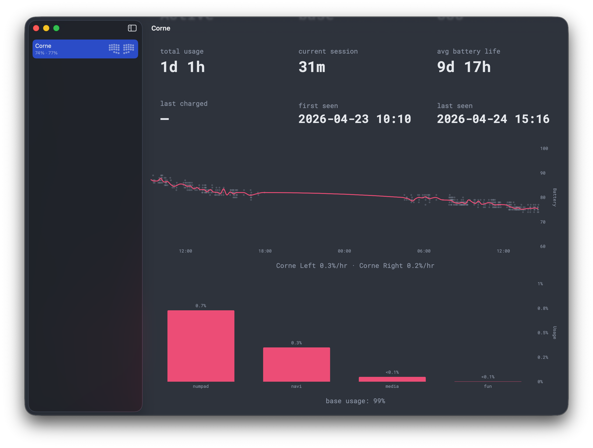
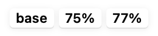
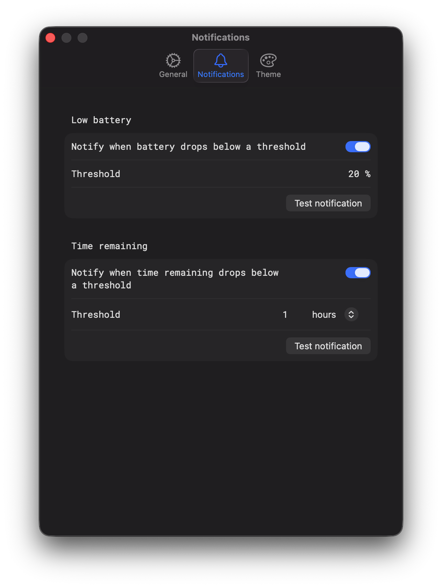
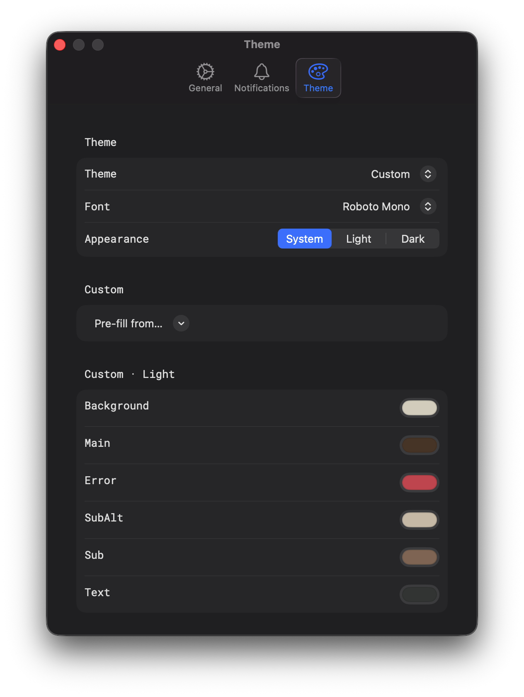
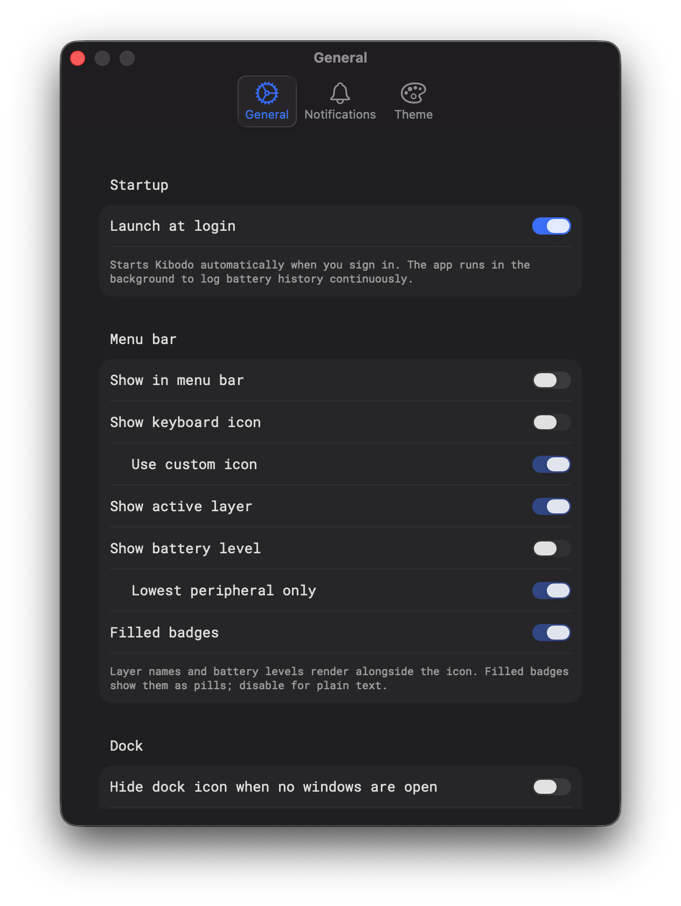

  

  A native macOS companion app for ZMK split keyboards. Monitor per-half battery levels, time-remaining projections, layer activity, and more.

  

---

## What it does

Kibodo pairs with [`kibodo-firmware`](https://github.com/undergroundpost/kibodo-firmware), a small ZMK module that runs on your dongle and split halves, to surface everything you'd want to know about your wireless keyboard's batteries:

- **Per-half battery levels** with live updates as the dongle reports.
- **Time-remaining projections** computed from discharge history via least-squares regression.
- **Active layer monitoring** that mirrors what your on-dongle display shows.
- **Long-term battery history** plotted in a chart with auto-scaled time axes (hours up to weeks).
- **Layer usage breakdown** showing how you actually use your keymap, with the dominant layer broken out so the bar chart auto-scales to the layers that matter.
- **Configurable threshold notifications** for low battery percent and low time-remaining.
- **Quiet, lightweight menu bar presence** — designed to consume basically nothing while it sits idle.

## Features

### Summary view

The detail view for any keyboard gives you everything in one scroll:

  

- **Peripheral cards** — one per half, with the keyboard's physical-layout icon, current percent, and projected time remaining.
- **Stat grid** — Status, Active Layer, Samples, Total Usage, Current Session, Avg Battery Life, Last Charged, First Seen, Last Seen.
- **Battery trend chart** with auto-bucketed averaging and per-peripheral discharge rates in the footer.
- **Layer usage bar chart** showing time-in-layer percentages across all observed activity. When one layer dominates (your base layer, almost always), it's peeled off into a footer line and the remaining layers auto-scale to fit.

### Menu bar

Configurable to show only what you want: keyboard icon, active layer, battery percent, or any combination. Battery can be all peripherals or just the lowest. Filled-pill or plain-text styling.

  
  &nbsp;&nbsp;
  
  &nbsp;&nbsp;
  

### Notifications

Two independent notification thresholds:

  

- **Low battery** fires once when any peripheral crosses below your chosen percent. Re-arms after the battery rises 3% above the threshold.
- **Time remaining** fires once when projected time remaining crosses below your chosen value (minutes / hours / days). Re-arms with 25% hysteresis.

### Themes & fonts

Built-in themes plus full customization.

  

### General

  

- **Launch at login**: register the app to run on startup so battery history is logged continuously.
- **Hide dock icon when no windows are open**: menu-bar-only mode.
- **Disconnect threshold**: how long without a reading before a keyboard is considered offline.

### Keyboard identification

Right-click any keyboard in the sidebar to assign a layout from the pre-loaded catalog:
- Corne 5-col / 6-col
- Sofle
- Kyria
- Lily58
- Iris
- Ferris Sweep
- Cantor
- A. Dux
- Piantor
- Chocofi
- Totem

The matching physical layout drives the small icons next to each peripheral, the full-keyboard preview in the sidebar, and (optionally) the menu-bar icon. Pick "None" to opt out of custom iconography entirely. If your keyboard isn't listed here, it will still work with the app, just without your layout's specific iconography.

## How it works

For Kibodo to see your keyboard, you'll need to add [Zephyr module](https://github.com/undergroundpost/kibodo-firmware) to your your dongle's firmware. The module exposes a vendor-defined USB HID interface (Usage Page `0xFF00`) carrying:

- per-peripheral battery percent (Report ID 1)
- per-peripheral side label (Report ID 2)
- active layer index (Report ID 3)
- layer name table (Report ID 4)

The Mac app connects via IOKit's `IOHIDManager`, persists samples via SwiftData, and computes everything else (projections, lifetime, charge detection, time-in-layer) on-device. No network, no telemetry, no account.

## Status

The macOS app is paired with [`kibodo-firmware`](https://github.com/undergroundpost/kibodo-firmware) and currently only supports ZMK splits with a USB-connected dongle as the central. Wireless-only / non-dongle setups aren't supported yet.

## License

MIT.
